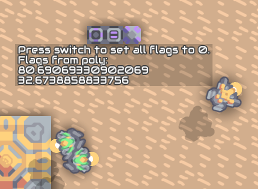
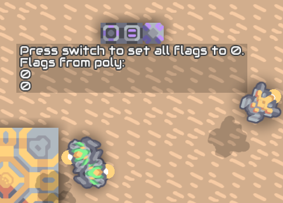
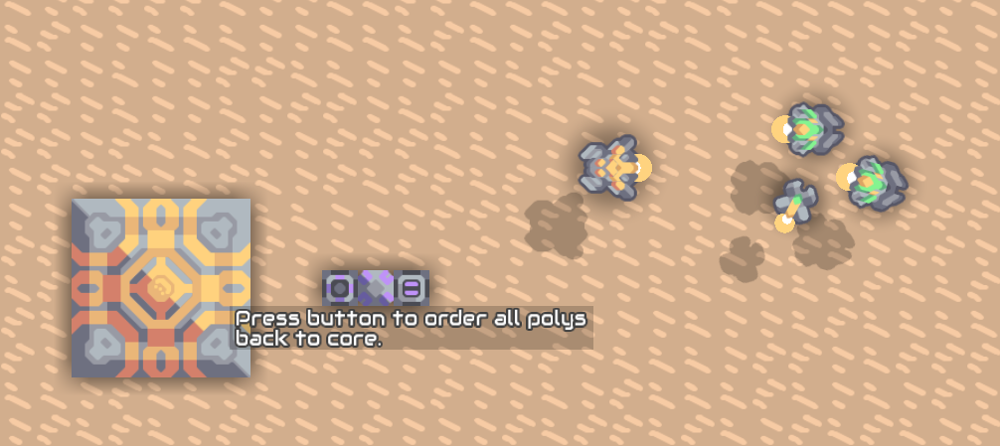
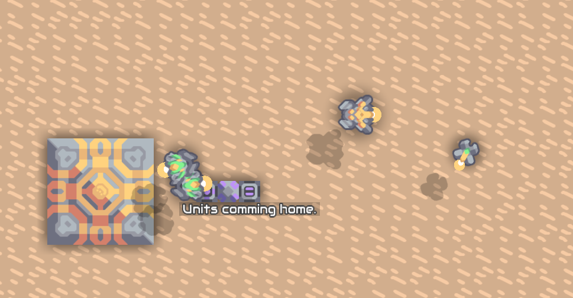

# Units

Example program for controlling units.

## Count Units

## Get Items

## Print all Flags

## Reset Flags

Resets the flags to 0 for all units of the selected unittype if button is pressed. This is useful if your logic has messed them.

[Schematic](./reset_flags.msch)

## Return to Core

If the button is pressed all units of the selected unittype returns to core.

