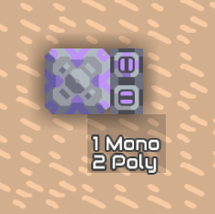
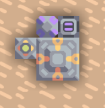
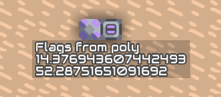
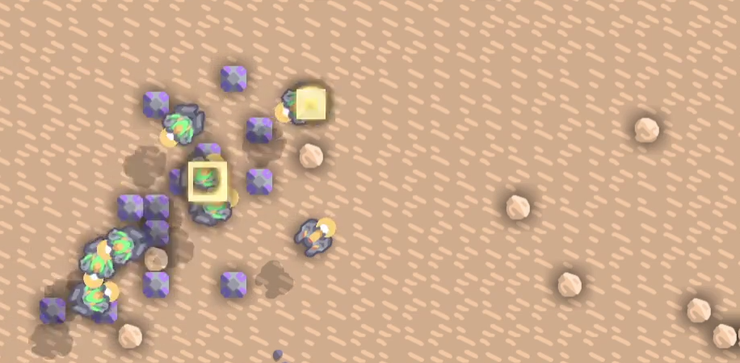
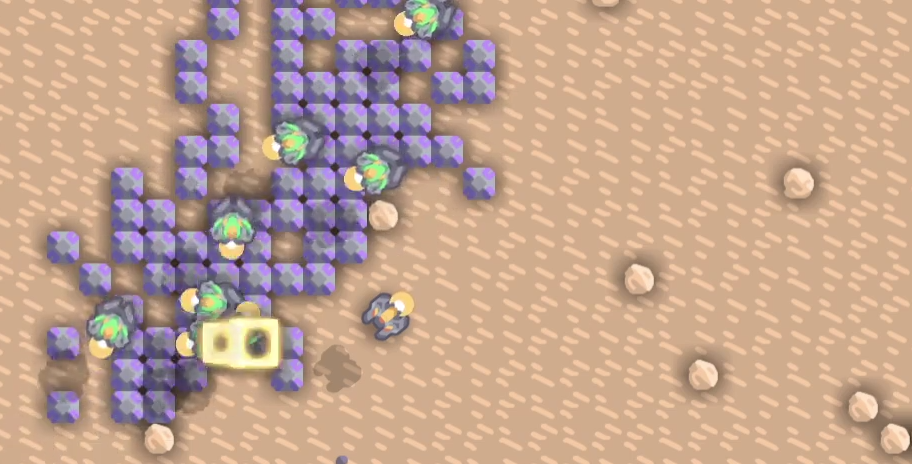

# Units

Example program for controlling units.

## Count Units

Counts the amount of all units of all types.

[Schematic](./count_units.msch)

## Get Items

Binds a unit of the selected type and uses this unit to transport items from the core to the connected container. Selection of items can be done with an unloader.

[Schematic](./getitems.msch)

## Print all Flags

Prints all flags of the units of the selected unittype.

[Schematic](./print_all_flags.msch)

## Reset Flags

Resets the flags to 0 for all units of the selected unittype if button is pressed. This is useful if your logic has messed them.

[Schematic](./reset_flags.msch)

## Return to Core

If the button is pressed all units of the selected unittype returns to core.

## Virus

The idea is that the processors copy themself and replicate over the map. Both versions aren't working well.

