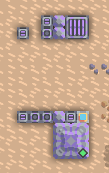
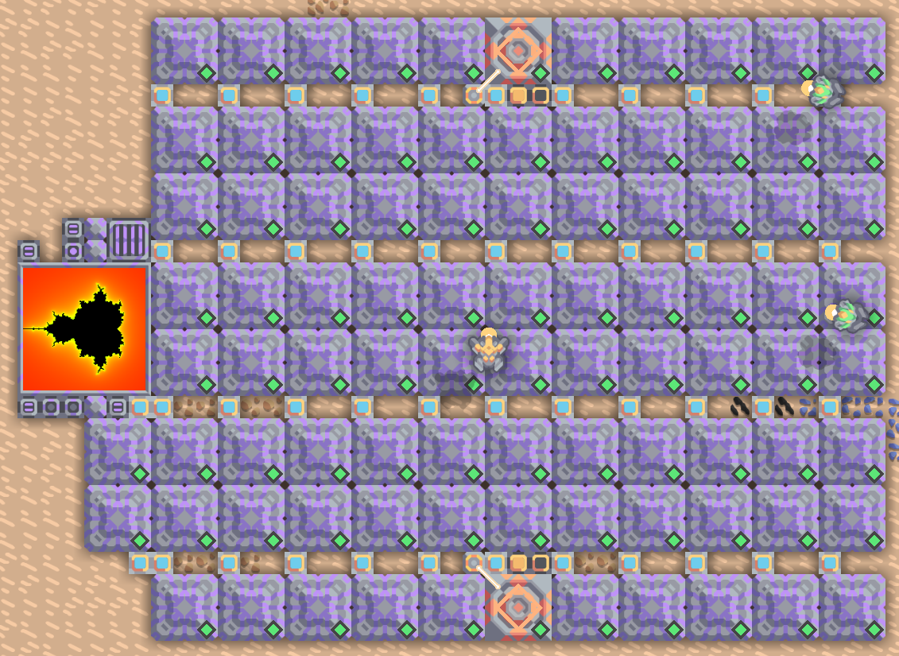
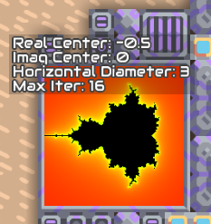
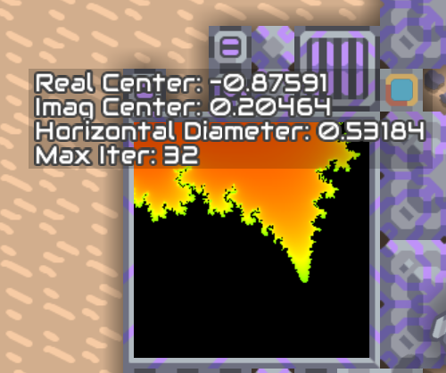
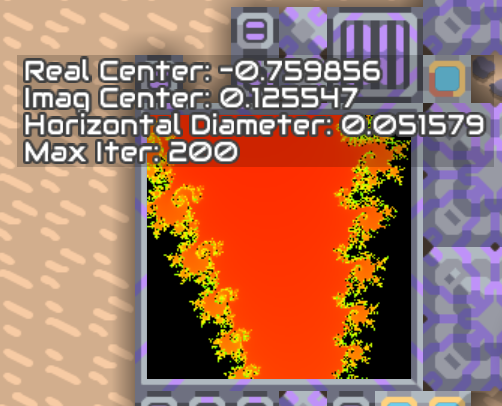

# Mandelbrot

## Sync
`sync.amnd` is an synchronous example implementation of mandelbrot. This will be too slow if you can't increase your game speed.

## Parallel
`parallel/` contains an asynchronous approach.

This version contains a script `parallel/procs_builder.amnd` which is used to replicate a processor 87 times, so that you don't need to do this manually.

The file `parallel/async.amnd` contains the script that is run parallel and that calculates the Mandelbrot. The file `parallel/async_main.amnd` is used to configure the memory bank that the parallel processors are using for configuration.

The schematic. You need one poly that builds the processors.

How it looks after the poly has copied the processors.

